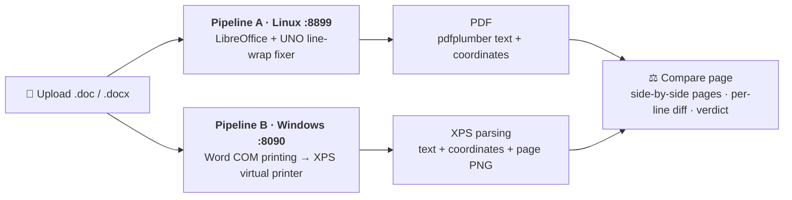

<div align="center">


# Word Print Layout Pipeline

**A dual-pipeline engine for Word layout fidelity — Linux conversion × real Windows printing, verifiable page by page, line by line**

[](https://github.com/UnstoppableCurry/word-print-layout-pipeline/releases)
[](LICENSE)
[](#-architecture)
[](#-pipeline-a--linux)
[](#-pipeline-b--windows)
[](#-pipeline-a--linux)

**[ 中文文档 → README.md ](README.md)**

</div>

---

## 🎯 The Problem

Your document-diff service runs on Linux. When Word files are converted to PDF with open-source tools (e.g. LibreOffice) and parsed for **text + coordinates**, the resulting **pagination and line breaks differ from what Word / WPS actually prints on Windows** — lines shift, content spills across pages, and the comparison produces false mismatches.

This repository provides two **independently deployable, cross-verifiable** pipelines:

| Pipeline | OS | Approach | License cost |
|:---:|:---:|---|:---:|
| **A · `linux-pipeline`** | Linux | LibreOffice headless + **UNO line-wrap fixer** → PDF → pdfplumber text + coordinates | **Zero** (fully open source) |
| **B · `windows-printnode`** | Windows | Real Word / WPS **printing** to the XPS virtual printer → parse XPS for text + coordinates + page renders | Reuse existing Office license |
| **Compare UI** | built into A | Upload a Word file → both pipelines run → verdict + side-by-side pages + per-line text/coordinate diff | — |

## 🏗 Architecture



## ❓ Why LibreOffice output differs from real printing

LibreOffice and Word apply **different line-breaking rules**. The classic failure: long runs of *digits + full-width punctuation*. Word / WPS treat them as a sequence that may break character by character, while LibreOffice treats the whole run as **one unbreakable western word** and pushes it to the next line — shifting every following line and spilling content onto the next page.

`uno_linewrap_fix.py` reads the document's real fonts, sizes and text width through the UNO API, simulates Word's line breaking with two calibrated models (token model / compressed per-character model), and inserts explicit line breaks before conversion to force alignment. In production testing, output matches the Windows print baseline with **100% identical per-page line counts**.

## 📁 Repository Layout

```
linux-pipeline/            Pipeline A · Linux word2pdf + dual-pipeline compare service
├── app.py                   Flask service (:8899) — upload Word → parse with A/B + compare UI
├── uno_linewrap_fix.py      UNO line-wrap fixer (core of pipeline A · dual breaking models)
├── requirements.txt
├── start_uno.sh             Start the LibreOffice UNO listener (127.0.0.1:2002)
├── lo-uno.service           systemd · UNO listener daemon
└── word2pdf-test.service    systemd · Flask service daemon

windows-printnode/         Pipeline B · Windows print-parse node (:8090)
├── PrintParseService.cs     Zero-dependency single-file service: Word COM → XPS → text + coords + PNG
├── setup.ps1                Node bootstrap: pin XPS printer to file port · compile · autostart
├── setup.cmd                cmd wrapper for setup.ps1 (unattended-install entry)
└── autounattend.xml         Win10 VM unattended answer file (password is a placeholder — replace it)
```

## 🚀 Pipeline A · Linux (verified on CentOS 7)

```bash
# 1. Install LibreOffice 7.6 to /opt/libreoffice7.6 (version pinned — do not upgrade casually)

# 2. Deploy the code
mkdir -p /opt/word2pdf-test
cp linux-pipeline/{app.py,uno_linewrap_fix.py,requirements.txt} /opt/word2pdf-test/
python3 -m venv /opt/word2pdf-test/venv
/opt/word2pdf-test/venv/bin/pip install -r /opt/word2pdf-test/requirements.txt

# 3. Register and start services
cp linux-pipeline/{lo-uno.service,word2pdf-test.service} /etc/systemd/system/
systemctl daemon-reload
systemctl enable --now lo-uno word2pdf-test

# 4. (Optional) Hook up pipeline B
systemctl edit word2pdf-test   # add Environment=XPS_API=http://<windows-node-ip>:8090
```

Open `http://<server>:8899` and upload a `.doc / .docx` to see the side-by-side A/B comparison.

## 🖨 Pipeline B · Windows

> No VM required — **any office PC with Word or WPS installed** works:

```powershell
# Administrator PowerShell, inside the windows-printnode directory
powershell -NoProfile -ExecutionPolicy Bypass -File .\setup.ps1
```

`setup.ps1` will: pin the Microsoft XPS Document Writer to a file port (prints write directly to disk, zero dialogs) → compile with the system-bundled `csc.exe` (zero external dependencies) → register autostart and launch.

**HTTP API (:8090)**

| Method | Path | Description |
|:---:|---|---|
| `GET` | `/health` | Health check → `{"status":"ok","engine":"word"}` |
| `POST` | `/api/print-parse` | Upload doc/docx → per-page text + coordinates + page render URLs |
| `GET` | `/images/{job}/{n}.png` | Page render image |

<details>
<summary><b>🖥 Unattended VM installation (optional)</b></summary>

Package `autounattend.xml` + `setup.cmd` + `setup.ps1` + `PrintParseService.cs` into an ISO and attach it — Windows installs and self-deploys the service with zero interaction. The password in the answer file is the placeholder `CHANGE-ME-Password`; **replace it before use**.
</details>

## ✅ Verified Results

| Test document | Pipeline A lines/page | Pipeline B (print baseline) | Result |
|---|:---:|:---:|:---:|
| Multi-page digit-run document (7 pages) | 46, 45, 45, 45, 45, 45, 44 | 46, 45, 45, 45, 45, 45, 44 | ✅ identical |
| Legacy multi-page document (7 pages) | 47, 46, 45, 45, 45, 45, 45 | 47, 46, 45, 45, 45, 45, 45 | ✅ identical |
| Line-wrap test document (1 page) | 4 | 4 | ✅ |
| Single-page authorization letter (1 page) | 15 | 15 | ✅ |

## ⚖️ Licensing

- **This project**: [MIT License](LICENSE) — free for commercial use
- **Pipeline A**: depends on LibreOffice (MPL 2.0); server-side use raises no licensing issues
- **Pipeline B**: depends on Windows + Microsoft Word / WPS — ensure the host machine itself is properly licensed (reusing an already-licensed office PC is the easiest path); Microsoft's licensing terms do not permit server-side Office automation serving unlicensed clients
- **Commercial SDK alternatives** (Aspose / Spire, etc.): measured line-breaking differs from real Word printing, and licenses run thousands to tens of thousands of USD per year — deliberately not used here

---

<div align="center">
  <sub>Built with ❤️ for layout-faithful document processing · <a href="README.md">中文文档</a></sub>
</div>
